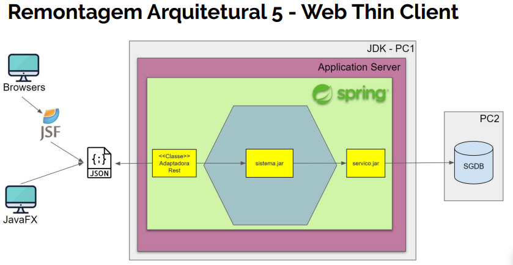

# Arquitetura Hexagonal
Este projeto é um estudo e anotações sobre a implementação de um simples **projeto de transferencia bancária** utilizando
os principais recursos da **arquitetura hexagonal**. Um projeto pequeno, mas suficiente para implementar todo o ciclo e as decisões mais
fundamentais sobre esse padrão arquitetural. 


Arquitetura Hexagonal

Implementação do Projeto de transferência Bancaria 

A arquitetura Hexagonal, foi criada em 2005 por Alistair Cockburn, e é um padrão de arquitetural para 
projetos de software,  uma solução geral e reutilizável.  

Consiste em regras e princípios, que definem como será a organização estrutural e abstrata 
dos componentes de um  software, seus relacionamentos e suas interfaces externas.

Não é a bala de prata mas se bem trabalhada, pode te da poder de construir uma. 
A arquitetura hexagonal tem se destacado como uma ótima opção para arquitetura de software, custo baixo e 
com poucos pontos negativos, retorno alto é rápido e com muitos pontos positivos.
Uma opções dentre tantos  padrões arquiteturais encontradas no mercado como: DDD, Onion e Clear Architecture. 

## Objetivo
Visa simplificar processos específicos de acordo com rotinas definidas e práticas. 
Criando soluções de software que tenha uma arquitetura igualmente executada por usuários,
programas, testes automatizados, e que seja desenvolvido e testado isoladamente de seus dispositivos 
externos, levando a equipe de desenvolvimento focar somente  no desenvolvimento do requisitos de negócio, 
ignorando dependências externas técnicas e infra estruturais, chamados de "Ports and Adapters Patterns".

## Benefícios
A arquitetura hexagonal permite projetar e construir aplicativos de software, de forma   moderna, 
robusta e altamente flexível, orientadas pelas premissas básicas da filosofia de desenvolvimento ágil:
 1. Desenvolvimento orientado a TDD.
 2. Foco nos requisitos de negócio.
 3. Adiar decisões técnicas o máximo possível.


# Implementação da arquitetura hexagonal  

## Projeto de transferência bancaria  

**Solução:** Desktop Standalone Monolithic Application

É uma solução de software ***desktop***, projetada para ser instalada
e executada dentro do pc do usuário final. A  solução roda em cima do SO proprietário,
apresentando interfaces gráficas nativas a plataforma.

É ***Standalone*** pois é uma solução projetada para ser executada localmente sem a necessidade de chamadas remotas. Todo o código dessa solução está localizada fisicamente no mesmo
lugar.

E por consistir na solução projetada de forma com que todas as suas funcionalidades são colocados em um único executável a partir de uma única plataforma, é considerada ***monolithic***.

Arquitetura da solução: Cliente-Server    
Onde o código da solução é todo
contido e executado no pc do usuário final, se comunicando
com um banco de dados relacional executando em um servidor remoto, no projeto o banco de dados será executado local).    
  


# Design do projeto


A arquitetura hexagonal vem incompleta para você completar com suas decisões de design. Seguem as do projeto de transferência entre contas:

● ```3 projetos separados:``` sistema.jar (hexagonal), servicos.jar (lado direito) e desktop (lado esquerdo).   
● ```Dependências frameworks via maven.```   
● ```Dependências hexagonal via maven system local.```   
● ```Organização de pacotes misto de DDD e metáforas hexagonal.```   
● ```Organização de negócio via EAA: Modelo de Domínio e Serviço de Domínio.```

   
● ```Organização das Portas Primárias:``` várias interfaces, cada 
uma agrupando operações relacionadas. Mas no projeto teremos apenas 1 grupo.  
● ```Transferência de dados:``` variáveis simples.  
● ```Consumo de objetos de backservices``` somente nos objetos de portas, deixando a regra de negócio puro POJO sem dependência com o mundo externo.

### Tecnologias
● ```Dependências frameworks java via maven.```    
● ```Banco de dados relacional HSQDB.``` Para desenvolvimento e homologação vamos usar em modo "embedded database".  
● ```Para produção vamos usar em modo "local jvm".```  
● ```Front-End usaremos desktop via JavaFX.```  
● ```Provedor de persistência Spring JDBC.```  
● ```Provedor de transação Spring Transaction.```  
● ```Provedor de IoC Spring IoC.```  
● ```Validação de negócio manual, nenhum framework.```  
● ```Builds IoC via Java Config manual, nenhum framework```  

### Ambiente 
- Java 12
- IDE Intellij 200.3
- Tdd,
- JUnit
- OOP
- Polimorfismo
- JDbC
- Spring 
- JavaFX


### Protótipo de tela 


### Banco de dados Scripts SQL 
***Criação da tabela Conta*** 
create table conta ( numero integer primary key, saldo decimal (10,2), correntista varchar(200) );


## Classes e Serviços
Organizando os grupos de serviços e as dependências dentro do hexágono:   
Sugestão de fazer 4 divisões de serviços:  
```1. Modelo de Domínio [EAA - Domain Model].```   
```2. Serviço de Domínio [EAA - Service Layer].```    
```3. Portas Dirigidas + implementações de adaptadores mokados.```    
```4. Portas Condutoras + implementações controladoras.```  

### 1. Modelo de Domínio
● Responsável por agrupar interfaces, classes, objetos de domínio, objetos de
valor e enums que implementam exclusivamente as regras de negócios.  
● Mapeia o mundo real em abstrações, estados e entidades usando os conceitos
de POO.   
● Não depende de nada, somente do próprio serviço

1 -

### 2. Serviço de Domínio
● Responsável por agrupar interfaces, classes, objetos de valor e enums que implementam exclusivamente os processos de negócio.   
● Esse serviço recebe implementação de processos compostos que envolvem executar várias operações de domínios diferentes e que normalmente não se encaixam dentro do modelo de domínio.   
● Mapeia o mundo real em abstrações, estados e entidades usando os conceitos de POO.   
● Depende do serviço de Modelo de Domínio e do próprio serviço.


### 3. Portas Dirigidas
● Responsável por agrupar as interfaces (SPI), classes e enums que definem
polimorficamente todos os serviços “backservices” que a sistema precisa para funcionar.

● Mapeia os serviços externos em abstrações, usando os conceitos de POO.

● Responsável por agrupar implementações das interfaces "mocks", emulando todos os serviços infra estruturais, de forma com que o sistema possa ser executado e testado sem ter infraestrutura.

● Pode depender do Modelo de Domínio , Serviço de Domínio e do próprio serviço.


### 4. Portas Condutoras - Casos de Uso

● Responsável por agrupar as interfaces (API), classes e enums que definem as funções e ou eventos ofertados pelo sistema.

● Mapeia os serviços ofertados em abstrações, usando os conceitos de POO.

● Responsável por agrupar as classes implementações das interfaces controladoras, que traduzem um pedido externo do hexágono para dentro, executando as operações.

● Único e exclusivamente responsável por executar operações nas interfaces de portas dirigidas, em prol de processar funções e ou eventos.

● Pode depender do Modelo de Domínio, Serviço de Domínio e Portas Dirigidas

# Sequência de Desenvolvimento
● PASSO 1 - Hexágono (Centro)   
● PASSO 2 - Front-End (Lado Esquerdo)   
● PASSO 3 - Back-Services (Lado Direito)   
● PASSO 4 - Build de Produção  

## PASSO 1
### Hexágono   
O ponto de partida é implementar o hexágono como uma caixa preta, com as interfaces de portas definidas em torno dela, tanto no lado esquerdo, quanto no lado direito.
Ou seja, implementar, testar e validar os serviços do sistema, sem tela, sem infraestrutura, usando ```TDD e mocks.```  

De forma opcional,  pode haver uma sub organização que pode fazer uso de dependência configurável entre os próprios componentes internos.

**Build 1:**   
**Dentro do Hexagono**
```Build 1 - Adaptador TDD -> Core <- Mocks.```  
Executado por classes de testes, dentro do pacote de testes do projeto de dominio, utilizando 
Mocks de BD e FrontEnd Mocks.


### Estrutura de pacotes 
```
Driver:.
|
|
+---META-INF (1)
+---out (2)
|   \---artifacts (3)
|       \---sistema (4)
+---src
|   +---main
|   |   +---java
|   |   |   \---conta (5)
|   |   |       +---adaptador (6)
|   |   |       \---sistema (7)
|   |   |           +---casouso (7)
|   |   |           |   +---imp (9)
|   |   |           |   \---porta (10)
|   |   |           +---dominio (11)
|   |   |           |   +---modelo (12)
|   |   |           |   \---servico (13)
|   |   |           \---porta (14)
|   |   \---resources (15)
|   \---test
|       \---java
|           \---teste (16)
|               +---casouso (17)
|               \---unidade (18)
|                   \---dominio (19)
|                       +---modelo (20)
|                       \---servico (21)
\---target (22)
```

### Descrição dos pacotes  

***Controle***  
**META-INF (1)** - Gerado pela IDE ao gerar o arquivo sistema.jar do projeto  
**out (2)** - Geradodos pela IDE para gravar o arquivo jar do projeto  
**artifacts (3)**  - controle da  IDE ao gerar .jar    
**sistema (4)**  - Contém o arquivo .jar gerado da aplicação.  
***
***Dominio***  
**conta (5)**  - Contém a entidade de dominio ```Conta```  
**adaptador (6)** - Contém o adaptador (Classe Mock) que simula o banco de dados.  
**sistema (7)** - Usada para organizar o modelo  
Convenção: Nome do dominio  
**casouso (7)** - Pasta de organização dos casos de uso    
Convenção: Casos de uso do sistema   
**imp (9)**  - Contém as classes de implementação da porta de acesso externo   
e interno ao dominio.   
**porta (10)** - Contém a interface de entrada do frontEnd    
**dominio (11)** - organiza o modelo de dominio  
**modelo (12)**  -  Pasta que contem as classes de entidades, e classe de suas possiveis mensagem de erro.   

***
***Backservices***  
**servico (13)** - Contém as classes de serviço do dominio    
**porta (14)** Contem a interface que permite o acesso a porta de serviços de backend do dominio    
**resources (15)** Contem os recursos que pode ser utilizados pelo dominio (sem uso)    

***
**Testes**   
**teste (16)** - Pasta  de organização dos testes do dominio  
**casouso (17)** - Contem as classes do Build1 e classes de testes  do adaptador front End(Mock) do dominio  
**unidade (18)**  - Organiza os testes em unidades de modelo e serviços  
**dominio (19)** -  Pasta de organização dos testes 
**modelo (20)** - Contém as classes de testes das regras de negocio das entidades de dominio. 
**servico (21)** - Contém as classes de testes dos backservices  


### Classes dentro da estrutura de pacotes
```
Driver:  
|  
|           
+---META-INF     
|   MANIFEST.MF (1)  
|  ´     
+---out
|   \---artifacts
|       \---sistema
|               sistema.jar (2)
|               
+---src (7)
|   |   module-info.java (3)
|   |   
|   +---main
|   |   +---java
|   |   |   \---conta
|   |   |       +---adaptador
|   |   |       |       AdaptadorContaFakeImp.java (4)
|   |   |       |       
|   |   |       \---sistema
|   |   |           +---casouso
|   |   |           |   +---imp
|   |   |           |   |       PortaTransferenciaImp.java (5)
|   |   |           |   |       
|   |   |           |   \---porta
|   |   |           |           PortaTransferencia.java (6)
|   |   |           |           
|   |   |           +---dominio
|   |   |           |   +---modelo
|   |   |           |   |       Conta.java (7)
|   |   |           |   |       Erro.java  (8)
|   |   |           |   |       NegocioException.java (9)
|   |   |           |   |       
|   |   |           |   \---servico
|   |   |           |           Transferencia.java (10)
|   |   |           |           
|   |   |           \---porta
|   |   |                   ContaRepositorio.java (11)
|   |   |                   
|   |   \---resources
|   \---test
|       \---java
|           \---teste
|               |   SuiteCore.java (12)
|               |   
|               +---casouso
|               |       Build1.java (13)
|               |       TesteAdaptadorTransferencia.java (14)
|               |       
|               \---unidade
|                   \---dominio
|                       +---modelo
|                       |       TesteCreditoConta.java (15)
|                       |       TesteDebitoConta.java (16)
|                       |       
|                       \---servico
|                               TesteTransferencia.java (17)
|                               
|--- pom.xml (18)
```
### Descrição dos arquivos na estrutura de pacotes  

```MANIFEST.MF (1)``` - Gerado automaticamente pele IDE ao criar o jar do sistema      
```sistema.jar (2)``` - Gerado pela Maven System na IDE ao criar o jar do sistema  
```module-info.java (3)``` - Contem instruções de acessos aos pacotes do sistema  
```AdaptadorContaFakeImp.java (4)``` - Classe Mock que simula o Banco de dados  
```PortaTransferenciaImp.java (5)```  - Implementação da portas de acesso do FrontEnd, e injecao do dominio e backservices   
```PortaTransferencia.java (6)``` Interface implementada pela classe PortaTransferenciaImp  
```Conta.java (7)``` - Classe que representa a entidade seus atriburos e suas regras de negocios   
```Erro.java  (8)``` - Classe que contém as mensagens de erro que o dominio pode subir   
```NegocioException.java (9)```  - Classe que implementa os recursos de contrele de Execções do dominio  
```Transferencia.java (10)``` -  Interface de acesso do frontEnd ao dominio  
```ContaRepositorio.java (11)```  - Interface de acesso ao serviço de banco de dados   
```SuiteCore.java (12)``` - Classe de testes que executa todos os testes do dominio      
```Build1.java (13)```  - Classe que prepara o ambiente, para injeção das classes necessárias
a execução da aplicação, faz o processo de Ioc da Arquitetura. Faz com que o Front e Back dependam do Hexagono para executar.  
```TesteAdaptadorTransferencia.java (14)``` - Classe de Teste do adaptador de front end (Testes dos Requisitos Funcionais)  
```TesteCreditoConta.java (15)``` - Classe de teste das regras de negocio ```Credito conta``` da entidade ```Conta```     
```TesteDebitoConta.java (16)```  - Classe de teste das regras de negocio ```Debito conta``` da entidade ```Conta```   
```TesteTransferencia.java (17)``` - Classe que testa a camada de serviço do dominio  
```pom.xml (18)``` - Contém as configurações das lib da aplicação  


### PASSO 2
### Front-End (Lado Esquerdo)   
**Lado condutor primário:**  
**Build 2** - ```Adaptador Real (interface grafica) -> Core <- Mocks.```    
Executado no projeto de Front-End  com adaptador Real da tecnologia de frontEnd e
utilizando adaptador backservice de BD Mock.

**Ambiente:** Desenvolvimento

A conversa é iniciada pelo driver (ator primário), portanto, o adaptador do driver
tem uma dependência configurável na porta do driver, que é uma interface implementada
pelo aplicativo.


Implementar os adaptadores primários condutores, plugando na porta do hexágono.
Ou seja, implementar, testar e validar, tecnologias e frameworks de Front-end,
usando serviços de backservices Mocks.  

### Classes e Serviços

Organizar os agrupadores de serviços e as dependências fora do hexágono: 
Lado esquerdo superior: Teremos um único serviço:  

● Adaptadores Condutores. Classes e Servicos Lado Esquerdo Adaptadores Condutores:

● Responsável por agrupar as classes adaptadoras, usando as tecnologias, frameworks, 
widget específicos de front-end ou input de dados, traduzindo as informações vindo
destes mecanismos para o sistema.

● Depende somente das interfaces das portas Condutoras.

● Para cada tipo de front-end, haverá um serviço adaptador. Dependência “de fora 
para dentro”. 


### PASSO 3
**Back-Services (Lado Direito)**
**Lado dirigido secundário:** A conversa é iniciada pelo aplicativo, portanto, o aplicativo tem uma dependência configurável na porta acionada, que é uma interface implementada pelo adaptador acionado do ator secundário
**Build 3:**
```Adaptador Real (Interface Gráfica`)-> Core <- Adaptador Real em Homologação.```  
**Ambiente:** Homologação  

Utiliza ***banco de dados em memoria*** e ***adaptador real de acesso a banco de dados***.  
Executa comandos de banco de dados, como criação de tabelas, e inserção de dados, etc..  
É um novo projeto que implementa o serviço Real de acesso a Banco de Dados, utiliza o ```Maven
System``` no ```pom.xml```, para acessar as dependências de dentro do hexagono (projeto sistema.jar) 
na pasta ```/out``` do projeto ```sistema.```  


pom.xml  
...
```
 <dependency>
            <groupId>conta.sistema</groupId>
            <artifactId>conta.sistema</artifactId>
            <version>1.0.0</version>
            <scope>system</scope>
            <systemPath>E:/workspace-dev/hexagonal/sistema/out/artifacts/sistema/sistema.jar
            </systemPath>
        </dependency>
```  

...  
Implementar os adaptadores secundários dirigidos (Real), plugando na porta do hexágono. 
Ou seja, implementar, testar e validar a tecnologia e frameworks de referente as
serviços necessários para a solução.    


### Estrutura de pacotes 
```
Driver:.
|
+---META-INF (1)
+---out (2)
|   \---artifacts  (2)
|       \---servico (3)
+---src
|   +---main
|   |   +---java
|   |   |   \---conta (4)
|   |   |       \---servicos (5)
|   |   |           \---repositorio (6)
|   |   \---resources (7)
|   \---test
|       +---java
|       |   \---teste (8)
|       |       \---integracao (9)
|       |           \---teste (10)
|       \---resources (11)
```

### Descrição dos pacotes  

```META-INF (1)```  - Criado pela IDE ao gerar o .jar da aplicação   
```out (2)```  - Criado pela IDE ao gerar o .jar da aplicação  
```artifacts  (3)``` -  Criado pela IDE ao gerar o .jar da aplicação  
```servico (4)``` -  Pasta de saida da geração do arquivo .jar  da aplicação
```conta (5)```  - Organiza servico    
```servicos (6)``` - Organiza o servico   
```repositorio (7)```  - Contém a classes de implementação da interface de acesso ao 
serviço de acesso a dados.    
```resources (8)``` -- Pode conter arquivos e outros recursos da aplicacao 
```teste (9)```  - Organiza testes dos serviços 
```integracao (10)```  - Organiza testes de serviço
```teste (11)```  - Organiza os testes do serviço
```resources (12)```   - Contém scripts sql que serão executados ao subir a aplicação.

### Arquivos e classes dos pacotes

```
Driver:.
| 
+---META-INF
|       MANIFEST.MF (1)
|       
+---out
|   \---artifacts
|       \---servico
|               servico.jar (2)
|               
+---src
|   |   module-info.java (3)
|   |   
|   +---main
|   |   +---java
|   |   |   \---conta
|   |   |       \---servicos
|   |   |           \---repositorio
|   |   |                   ContaRepositorioImp.java (4)
|   |   |                   
|   |   \---resources
|   \---test
|       +---java
|       |   \---teste
|       |       \---integracao
|       |           |   Config.java (5)
|       |           |   TesteContaRespositorio.java (6)
|       |           |   
|       |           \---teste
|       |                   SuiteIntegracao.java (7)
|       |                   
|       \---resources
|               create-db.sql (8)
|               insert-data.sql (9)
|               
+---pom.xml (10)
```

### Descrição dos arquivos nos pacotes

```MANIFEST.MF (1)```  - Arquivo criado pela IDE ao gerar o .jar da aplicação
```servico.jar (2)```  - Executavel criado pela IDE ao gerar os artefatos da aplicação
```module-info.java (3)``` Arquivo que permite informar libs necessarias a aplicação e 
abertura de acesso, as classes da aplicação.  
```ContaRepositorioImp.java (4)```  - Inplementação da interface (porta) de acesso ao adaptador de banco de dados   
```Config.java (5)``` - Classe de configuração do ambiente de execução e dos testes do serviço      
```TesteContaRespositorio.java (6)``` -  Classe de teste de acesso ao banco de dados  
```SuiteIntegracao.java (7)```  - Suite de testes, executa todos os testes do serviço  
```create-db.sql (8)```  - Script de execução SQL do dataSource do spring  
```insert-data.sql (9)```  - Script de execução SQL do dataSource do spring  
```pom.xml (10)```  - Arquivo de gerenciamento de dependências da aplicação (Maven).


### Classes e Serviços 

Organizar os agrupadores de serviços e as dependências fora do hexágono: no lado direito inferior: Teremos um único serviço:
1. Adaptadores Dirigidos. Classes e Servicos Lado Direito Adaptadores Dirigidos:

● Responsável por agrupar as classes implementações das interfaces SPI das portas dirigidas, usando as tecnologias, frameworks, protocolos e interagindo efetivamente com os serviços e ou dispositivos externos.

● Pode depende do serviço de Modelo de Domínio e Serviço de Domínio.

● Para cada dispositivo de interação, haverá um serviço adaptador.


### PASSO 4
**Build de Produção**  
Configurar o ambiente de produção e fazer o build oficial final:    
***Build 4:***```Adaptador Real (Interface Gráfica) -> Core <- Adaptador Real em Produção.```  
**Ambiente:** Produção    

Utiliza ***Adaptador Real de interface grafica*** e ***Banco de dados Real em arquivos***.  

### Estrutura de pacotes do projeto
```
descktop
|
|
+---img (1)
+---src
   +---main
   |   +---java
   |   |   \---conta (2) 
   |   |       +---dsv (3)  
   |   |       +---hml (4)  
   |   |       +---prd (5) 
   |   |       \---tela (6) 
   |   \---resources (7)
   \---test (8)

```

### Descrição dos pacotes

```img (1)```   - Contém as imagens do arquivo README.md da aplicação   
```conta (2)```  - Organiza pacotes de frontend  
```dsv (3)```  - Contém as classes de Build do ambiente de desenvolvimento  
```hml (4)```  - Contém as classes de Build do ambiente de homologação  
```prd (5)```  - Contém as classes de Build do ambiente de produção  
```tela (6)```  - Contém as classes do adaptador Real de FrontEnd  
```resources (7)```  - Contém os Script SQL que serão executados pelas classes Adaptadors de frontEnd   
```test (8)``` - Não utilizado.


### Classes e arquivos dos pacotes
```
Driver:.
|
|       
+---img
|       arquitetura_hexagonal.png (1)
|       estrutura_pacotes.png (2)
|       prototipo_tela.png (3)
|       
+---src
|   +---main
|   |   |   module-info.java (4)
|   |   |   
|   |   +---java
|   |   |   \---conta
|   |   |       +---dsv
|   |   |       |       Build2.java (5)
|   |   |       |       
|   |   |       +---hml
|   |   |       |       Build3.java (6)
|   |   |       |       
|   |   |       +---prd
|   |   |       |       Build4.java (7)
|   |   |       |       
|   |   |       \---tela
|   |   |               AdaptadorJavaFX.java (8)
|   |   |               TransferenciaFrm.java (9)
|   |   |               
|   |   \---resources
|   |           create-db.sql (10)
|   |           insert-hml.sql (11)
|   |           insert-prd.sql (12)
|   |           
|
+--pom.xml (12)
```

### Descrição dos arquivos e classes dos pacotes  
```arquitetura_hexagonal.png (1)```  - Arquivo de img da arquitetura.    
```estrutura_pacotes.png (2)```  - Arquivo de img dos pacotes  
```prototipo_tela.png (3)```  - Arquivo de img prototipo da tela  
```module-info.java (4)```  - Arquivo de configuração de acesso ao modulo e dependencias  
```Build2.java (5)```  - Arquivo de build desenvolvimento (BD memoria)  
```Build3.java (6)```  - Arquivo de build homologação (BD memoria)  
```Build4.java (7)```  Arquivo de build produção (BD arquivo)    
```AdaptadorJavaFX.java (8)```  - Classe de implementação do adaptador de javaFX,  
onde é possivel, selecionar qual Build sera executado(dsv, hml ou prd), comentando ou descomentando o código. 
```TransferenciaFrm.java (9)```  - Classe de formulario de input do javaFX.  
```create-db.sql (10)```   - Arquivo de Scrip SQL executado pelo datasource do Spring  
```insert-hml.sql (11)```  Arquivo de Scrip SQL executado pelo datasource do Spring  
```insert-prd.sql (12)```  Arquivo de Scrip SQL executado pelo datasource do Spring  
```pom.xml (12)``` - Arquivo de gerencimento de dependencia do Maven.  

## Fluxo de execução
- A arquitetura hexagonal aplica IoC, estabelecendo o princípio modular que o lado de fora direito tem dependência ao hexágono via IoC!

1. Lado esquerdo, os atores primários dependem do hexágono
2. Lado direito, os atores secundários dependem do hexágono via IoC.
3. O centro, o hexágono não depende de ninguém, só dele mesmo.

- IoC e o princípio de flexibilidade de intercâmbio de adaptadores, a arquitetura hexagonal estabelece o uso de um gerenciador de dependências de forma dinâmica e configurável em ambos o lados.

***Dependências Configuráveis***
- Princípio mais importante em que se baseia a arquitetura hexagonal, pois permite que o hexágono seja dinamicamente dissociado de qualquer tecnologia de front-end e infra-estrutura.
  Esse desacoplamento é o que possibilita o principal objetivo da arquitetura, ou seja, ter um aplicativo que possa ser executado por vários drivers e testado isoladamente de destinatários / repositórios.

O projeto hexagonal deve fazer uso de qualquer serviços de IoC de sua plataforma de preferência para montar a rede de objetos (wiring) de execução da solução, tando os build de desenvolvimento, testes, homologação e produção.

Exemplos Java:  
● CDI  
● Spring IoC  
● Pico Container


# Princípios básicos da Arquitetura Hexagonal 

### Separation of concerns   
 SoC princípio básico da engenharia de software, que visa separar, ou seja, modularizar uma 
solução de forma que cada módulo esteja focado em resolver apenas um único problema.
Permitindo elaborar uma arquitetura flexível, manutenível e sustentável.

### Isolamento  
 A arquitetura hexagonal aplica SoC, e estabelece o princípio de modularizar a solução em 3 áreas 
distintas e isoladas:

**1º. Centro como hexágono.**   
- Possui coisas importantes para o problema de negócio que a solução está tentando resolver.
- É a parte mais importante do sistema que contém todo o código que relaciona com lógica de negócios 
  do contexto da solução. 
- Abstrai as regras de negócio do mundo real em modelo de objetos. Ficara isoldada das outras partes
   (lados esquerdo e direito).
- Deve ser totalmente agnóstico a qualquer tecnologia, framework e infraestrutura relacionado a 
  interfaces gráficas, interfaces comunicações e dispositivos externos do mundo real. 
- Porem pode ter dependências de frameworks de serviços gerais, como por exemplos: Logg, IoC  e etc.


**2.	Lado superior esquerdo, fora do hexágono.**   
- Onde fica o **Ator Primário Condutor (Driver)**, é quem aciona a interação, coisas do mundo real que interage 
  com o aplicativo, para atingir um objetivo. Essas coisas incluem seres humanos, outros aplicativos ou qualquer dispositivo de hardware ou software. 
  Exemplos: Suites de testes, front-end desktop, front-end web, end-point rest e etc.
- Lado intercambiável e flexível através do qual um ator externo irá interagir e estimular a solução.
- Conterá código de tecnologia específica que irá disparar eventos na solução, normalmente um pessoa usando uma GUI ou programa externo via end point web services.

**3. Lado inferior direito, fora do hexágono.**
- Lado também intercambiável e flexível que fornecerá os serviços de infraestrutura que a solução precisar.
- Desse lado fica o **Ator Secundário Conduzido (Driven)**, Aplicativo que tem a  interação acionada pelo hexágono.
- Um ator secundários fornece funcionalidades necessárias ao hexágono para processar a lógica de negócios.
- Exemplos: banco de dados relacionais, nosql, serviços web http, stmp, sistema de arquivos e etc.
- Conterá código de tecnologia especifica,detalhes infraestruturais, normalmente código que interage com o 
  banco de dados, faz chamadas para o sistema de arquivos, chamadas HTTP e outros aplicativos dos quais depende.    
  

  #### **Existe dois Tipos de atores conduzidos**  

  **1.Repositório (Repository):** Com o objetivo de enviar e receber informações.
        Exemplo: Banco de dados ou qualquer outro dispositivo de armazenamento.  

  **2.Destinatário (Recipient):** É aquele com o objetivo de somente enviar informações e não espera resposta. 
  Exemplo, um envio de email SMTP ou um post HTTP.


# Dependências
Princípio de dependências da arquitetura hexagonal: "somente de fora para dentro!":
O lado esquerdo e o direito se tornam totalmente flexíveis, intercambiáveis e dependentes do centro.  

 1. Lado esquerdo, os atores primários dependem do hexágono.
 2. Lado direito, os atores secundários dependem do hexágono.
 3. O centro, o hexágono não depende de ninguém, só dele mesmo

# Portas
Implementação de interfaces de portas primárias (casos de uso), devem estar dentro do hexágono, e ser agnósticos 
a tecnologias e são usadas para definir e redirecionar as chamadas externas para dentro das operações 
de negócio oferecidas pela solução.   

- Princípio que, a comunicação "de fora para dentro" deve ser feita única e exclusivamente através de uma 
  "porta" (interface).  

 - As interações entre todos os atores e o hexágono são organizadas no limite do hexágono (Edge) através
    de uma ou várias portas (interfaces OOP).   

- As interfaces que contém apenas os protótipos dos métodos sem corpo, que polimorficamente definem um
  contrato de uso, e ao mesmo tempo isolam e encapsulam determinado serviço está sendo executado. 
  Atuam como isoladores explícitos entre o interior e o exterior da solução, tanto para o lado esquerdo
  de entrada, quanto o lado direito de saída, cumprindo o principal objetivo da visão hexagonal que é 
  ter “core” da solução 100% isolado, independente de tecnologia de GUI, dispositivos externos, 
  serviços infraestruturais e  orientado a TDD.


As interfaces seguem as regras de encapsulamento polimórfico e existe dois tipos de portas:   
  

 **1.  Porta Primária Condutor (Driver)** 
  - Lado do usuário da solução. 
  - Portas primárias formam a API (Application Programming Interface) da solução para entrada no hexágono. 
  - Devem ser mapeadas em formato de caso de uso, pois refletem exatamente as funções ou eventos que solução 
    precisa fazer.  


**2. Porta Secundária Dirigida (Driven)**  

 - São chamados pelo hexágono para executar serviços externos. 
- Portas secundárias formam a SPI (Service Provider Interface) que é requerida pela solução. 
- Portas secundárias possibilitam acessar dados em banco de dados relacionais, nosql, serviços web http, 
  stmp, sistema de arquivos, por exemplos inserir cliente, pesquisar fatura, procurar cliente inativos e etc.
- Todas as classes OOP que implementam a interfaces de portas secundárias devem estar fora do hexágono,
   pois elas usam alguma tecnologia específica e convertem chamada de negócio, agnóstico a tecnologia em 
   alguma necessidade infraestrutural e externa a solução.


# Adaptadores
Metáfora chamada de **"adaptador"**, componente de software que permite uma tecnologia externa interaja com uma porta do hexágono. Dada uma porta(interface), deve haver um adaptador para cada tecnologia externa que se deseja usar.

Fazem a “ponte” para que o hexágono possa ter input de dados do lado esquerdo e ter acesso 
ao serviços de infraestrutura do lado direito

Existem dois tipos de adaptadores:  

### 1. Adaptador Condutor (Driver)  
Para cada porta condutora, deve haver pelo menos dois adaptadores,  um para testar o comportamento via TDD e outro usando a tecnologia real requerida pela solução.

É o componente usado para converter uma solicitação de tecnologia específica em uma solicitação agnóstica e pura de sistema para uma porta condutora, traduzindo dados de entradas externos para dentro da solução.
 Objetivo: Responsável por fazer integração do lado de fora para dentro do hexágono. 

Exemplos: 
1. Suite de testes automatizada TDD: converte casos de teste em solicitações para a porta condutora.  

2. GUI de um aplicativo desktop: converte eventos acionados por componentes gráficos para a porta condutora.   

3. GUI de um aplicativo Web MVC: o controlador recebe do view a ação solicitada pelo usuário e o converte em uma solicitação para a porta condutora.   

4. Fila de Mensageria: uma mensagem da fila é recebida do serviço de mensagens e converte em uma solicitação para a porta condutora.  

### 2.	Adaptador Dirigido (Driven)  

Para cada porta dirigida devemos escrever pelo menos dois adaptadores: 
1. um para o dispositivo do mundo real. 
2. outro para um simulado que imita o comportamento real, chamado de mock.

- São classe são classes OOP que implementam as interfaces de portas dirigidas e que usam frameworks e tecnologias específicas, dando o suporte para aquelas necessidades de chamadas externas.  

 Exemplos:   

● Classe DAO via JDBC.   
● Classe EAO via JPA.  
● Classe envio via JavaMail usando SMTP.   
● Classe envio de sms consumidor de um web services jax-ws.  
● Classes cliente consumidor de um rest end point via jax-rs.  
● Classes cliente consumidor de um rest end point via Sprint RestTemplate.

São componente usados para converter chamadas de dentro do solução para fora, usando serviços de infraestrutura tecnológicos externos a solução. 
- Responsável por fazer integração de dentro do hexágono para o lado de fora  

Exemplos:  
● Um adaptador de email: Implementa uma porta orientada para notificar as pessoas enviando um email para elas.  
● Um adaptador App-To-App: Implementa uma porta controlada para obter alguns dados, solicitando-os a um aplicativo remoto.   
● Um adaptador fila de mensageria: Implementa uma porta controlada para enviar mensagens a outros soluções.  


### Adaptadores Simulados - Mock
Um mock é um componente usado emular ao hexágono os serviços reais ofertados de um dispositivos externo de modo que, o módulo do hexágono possa ser 100% desenvolvido, testado e homologado sem precisar instalar, configurar ou usar serviços, tecnologias ou infra estruturas pendentes a solução.

Mocks são classes OOP que implementam as interfaces de portas dirigidas com
objetivo de assinar o contrato de serviços emulando aqueles determinados serviços.  

Exemplos:   
● Classe DAO que ao invés de usar JDBC, faz a persistência em memória usando HashMap.   
● Classe DAO que ao invés de usar JDBC, faz a persistência em um sgdb embutido Hsqldb.  
● Classe envio de email que ao invés de usar JavaMail, faz System.out.println.  

# Opções de  Design da Arquitetura Hexagonal
Na arquitetura hexagonal não tem definidas  diretivas de criação dos projetos, como organização de pacotes, componentes, camadas, módulos, interfaces, classes, uso de padrões de projetos e tecnologias.

Cobre somente princípios de isolamento e separação, usando metáforas com o objetivo de fazer uma solução não depender de front-end e serviço externos, elaborando uma solução flexível e testável.  O arquiteto ou desenvolvedor é livre para organizar seu projeto de forma que quiser, balanceando os prós e contras de cada opção, usando seu know-how e os recursos que sua plataforma oferece, desde que: cada opção não fure os princípios hexagonal.  
Não existe bala de prata, certo ou errado, pior ou melhor. Analise cada um e faça sua decisão baseado em prós e contras, contexto e necessidade.


### Organização de Projeto:   
Segue as opções do mais simples ao mais sofisticado:  
1. Um projeto com os 3 módulos, separado por pacotes simples. 
2. Um projeto com os 3 módulos, separado por java modules 9. 
3. Três projetos diferentes, uma para cada módulo, usado jar manual. 
4. Três projetos diferentes, uma para cada módulo, usando jar via maven system.
5. Três projetos diferentes, uma para cada módulo, usando jar via maven repositorio local jfrog - https://jfrog.com/open-source/
6. N projetos diferentes, uma para cada módulo, um para cada front-end, um para cada back-service: database, nosql, sms, webservice etc, usando jar manual, maven system ou maven repositório local jfrog. 

### Organização de Pacotes: 
1.	Por tipos (Type) 2. 
2.	Por camada (Layer) 
3. Por serviço (Feature)
4. Por metáforas hexagonal (Ports, Adapters, etc)

### Implementação das regras de negócio dentro do hexágono: 
1. Transactions Script - EAA Pattern. 
2. Domain Model - EAA Pattern.
3. Service Layer - EAA Pattern.
4. Anemic Domain Model - EAA Pattern. 
5. Domain Driven Design - DDD.
6. Clean Architecture (Entities e User cases)
 

### Organização das Portas Primárias - Casos de Usos 
Segue as opções do mais simples ao mais sofisticado:
1. Uma única interface com várias operações distintas. 
2. Várias interfaces, cada uma agrupando operações relacionadas.
3. Uso do padrão de projeto: Command Bus
4. Uso do padrão de projeto: Command Query.

### Organização das Portas Primárias
 - Casos de Usos  
 Links:   
 ● https://medium.com/eleven-labs/cqrs-pattern-c1d6f8517314  
 ● https://tactician.thephpleague.com/   
 ● https://barryvanveen.nl/blog/49-what-is-a-command-bus-and-w hy-should-you-use-it   
 

### Transferência de dados
Segue as opções do mais simples ao mais sofisticado para transferir dados do lado esquerdo (front-end) para dentro do hexágono. 
A interfaces de casos de uso podem ser projetados usando as seguintes opções: 
   
1. Variáveis simples máximo de 4 [Joshua Bloch Java Effective item 40]. 
2. Padrão de Projeto Parameter Object. 
3. Padrão de Projeto Value Object.
4. Expor objeto de domínio como parâmetro. 
5. Objetos expansíveis como HashMap. 
6. Padrão de projeto “Typesafe Heterogeneous Container Pattern”. 
7. Objeto dinâmicos no uso de linguagens dinâmicas: groovy Expando. 


### Uso de objetos polimórficos de backservices  
Dentro do hexágono, existe duas opções para se consumir os serviços dos objetos de backservices:
1. Fazer IoC desses objetos em qualquer outro objeto dentro do hexágono, por livre demanda. Assim todos estes terão dependência com os backservices e deverão entrar no gerenciamento IoC. Isso pode ter prós e contras, dependendo de como foi organizado o hexágono. Opções de Design Uso de objetos polimórficos de backservices 

2. Limitar o IoC desses objetos somente nas implementações das portas primárias de caso de uso. Assim, somente esses objetos terão dependência com os backservices e deverão entrar no gerenciamento IoC.  Outros objetos, de outros serviços dentro do hexágono, não terão dependência com o backservices e poderão funcionar fora do IoC. Isso pode ter prós e contras dependendo de como foi organizado o hexágono. No geral, essa é a melhor opção, pois organiza melhor a estrutura e reduz os acoplamentos no hexágono. Opções de Design Uso de objetos polimórficos de backservices Não existe bala de prata, certo ou errado, pior ou melhor. Analise cada um e faça sua decisão baseado em prós e contras, contexto e necessidade. Opções de Design Dúvidas e comentários


# Vantagens
- Solução Independente de Frameworks.
- Sem configurações de bibliotecas ou frameworks relacionados do lado primário (front-end) ou  secundário (back-services).
- A solução permanece sem restrições limitadas de ferramentas, podendo usar uma infinidade de bibliotecas.

- Independente de Interface Gráfica:
- A interface gráfica do usuário pode ser alterada ao longo de tempo, sem alterar o resto do sistema.
- Uma UI de desktop pode ser substituída por uma UI web, ou por uma UI mobile, ou por um endpoint rest json, sem quebrar outras partes de código.
- Pode ter varias UI rodando ao mesmo tempo.
- Independente de Banco de Dados
- Não depende da existência e configuração de bibliotecas ou frameworks relacionado ao armazenamento de dados persistentes.
- O BD pode ser trocado  oracle, por sql server, por mongo ou qualquer outra coisa, sem quebrar outras partes de código.

- Independente de Serviços Externos
- Não depende de configuração de bibliotecas ou frameworks relacionado a serviços externos. - Um provider de SMS via SOAP poderia ser substituído por um outro provider de SMS REST , por exemplo, sem quebrar outras partes de código

**Decisões Técnicas.**
- A equipe não precisar esperar para: saber, decidir, aprender ou instalar as tecnologias e infraestruturas relacionadas ao front-end e a de back-services para dar vazão no desenvolvimento.
  A equipe pode desenvolver a solução se concentrando na lógica de negócios no "o que a solução faz"
- As tecnologias podem ser escolhidas, estudadas e configuradas mais tarde, codificando seus respectivos adaptadores
- Solução 100% testável: Toda as partes de solução estão separadas e podem ser facilmente ser testadas via TDD:

**Suite de Unitários:** Para testar os objetos simples das regras de negócio dentro do hexágono.

**Suite de Aceitação:** para testar o hexágono isoladamente. Eles verificam se a solução se comporta conforme o usuário espera, atendendo aos critérios de aceitação que ele definiu anteriormente para os casos de uso, sem a interface gráfica, sem um banco de dados, sem um servidor web ou qualquer outro elemento externo infraestrutural, usando adaptadores secundários mockados.

**Suite de Integração:** Para testar objetos adaptadores. Eles garantem que a tradução entre as portas e o mundo externo seja feita pelos adaptadores corretamente.

**Suite de Sistema:** para testar a solução por completo, usando os adaptadores e o hexágono juntos. Eles também testam a implantação e a inicialização do sistema, usado adaptadores secundários para ambientes de homologação

**Benefícios TDD** Permite que a solução seja realmente desenvolvida usando TDD e todas as suas vantagens: cobertura do código, prevenção proativa de bugs, lógica funcionando como esperado, facilita manutenção, refatoração com confiança, clean code, arquitetura evolutiva e design emergente.

**Adaptadores são substituíveis:** O papel das portas e adaptadores é converter pedidos e respostas à medida que eles vêm e vão do mundo exterior. Esse processo de conversão permite que o aplicativo receba solicitações e envie respostas a qualquer número de tecnologias externas sem precisar conhecer nada do mundo externo.

Essa aderência a interfaces nos permite substituir um adaptador por uma implementação diferente que esteja em conformidade com a mesma interface, de forma rápida, fácil e dinâmica, configurada via IoC sem interferir ou propagar erros para outras partes de código.

- Separação das diferentes ondas de mudanças: No geral são as camadas mais externas que normalmente mudam mais.

**A interface do usuário**, lidar com solicitações ou trabalhar com serviços externos normalmente evolui em um ritmo muito maior do que as regras de negócios da solução.

Essa separação permite que você faça qualquer alteração nas camadas externas sem tocar nas camadas internas que devem permanecer consistentes.

A camada interna não tem conhecimento da camada externa e, portanto, essas alterações podem ser feitas sem interferir ou propagar erros para outras partes de código.

**Troca fácil de diferentes tecnologias.** Para uma determinada porta, você pode ter vários adaptadores polimórficos, cada um usando uma tecnologia específica.

Para escolher um deles, basta configurar qual adaptador usar para essa porta.

- Essa configuração pode ser tão fácil quanto modificar um arquivo de propriedades de configuração externa. Nenhum código-fonte modificado, nenhuma recompilação, nenhuma reconstrução.
- Uma solução pode ser múltiplos adaptadores de diferentes filosofia de front-end e de back services.

**Separação em componentes diferentes:** Com o código front-end e o back services sendo plugado sobre a regra de negócio, eles podem ser separados em diferentes componentes. Executados em máquinas diferentes: Se estão em diferentes componentes podem ser executados separadamente “deployed independently” separadamente. [microservices]

**Separação em diferentes equipes:**
Se estão em diferentes componentes podem desenvolvidos em paralelos por diferentes equipes “independent developability”.

**Liberdade de escolhas nos detalhes de projeto:** A arquitetura hexagonal não define diretivas de criação dos projetos, organização de pacotes, componentes, camadas, módulos, interfaces, classes, uso de padrões de projetos e de tecnologias.

Ela cobre princípios de isolamento e separação usando metáforas com o objetivo de fazer uma solução não depender de front-end e serviço externos, elaborando uma solução flexível e testável. Arquiteto responsável fica livre para balancear os prós e contras de cada opção e fazer conforme for melhor.

**Alta manutenibilidade** As alterações em uma área da solução não afetam as outras partes. Adicionar recursos não requer grandes alterações na base de código. Adicionar novas maneiras de interagir com o aplicativo requer apenas adição de um novo adaptador sem alterar os resto. O tdd é 100% possível e relativamente fácil.

Tudo isso somado resulta em **alta manutenibilidade!**


**Erosão arquitetural** e dívida técnica Com as áreas de separação e as suas dependências bem definidas [front-end -> hexagonal <- back-services), a arquitetura hexagonal tende a reduzir os efeitos da erosão arquitetural e aumento da dívida técnica resultando do passar de tempo e na mudança de equipes.


**Profissionalismo** Ao aplicar essa abordagem, você torna seu código mais importante (lógica de negócio) livre de detalhes técnicos desnecessários, ganhando controle, confiança, flexibilidade, testabilidade e outras vantagens importantes que tornam seu processo de trabalho mais eficiente, rápido, seguro, assertivo e profissional.


**Aprendizado Rápido** É um padrão relativamente rápido e fácil de aprender, pois apenas organiza a estrutura da arquitetura em simples metáforas de portas e adaptadores. Desenvolvedores menos experientes podem ser facilmente ser adicionado a equipe, aderindo ao valores e princípios hexagonal.

- Cobre princípios de isolamento e separação usando metáforas com o objetivo de fazer uma solução não depender de front-end e serviço externos, elaborando uma solução flexível e testável

-  Em curto prazo, o investimento se reverte em lucro pela quantidade e velocidade das mudanças aplicadas no software.


# Desvantagens

- Complexidade Extra para Construir um aplicativo com várias camadas de abstração relacionado as portas e adaptadores

- Custo Da mesma forma, quando você tem muitas camadas de indireção e isolamento, o custo de criar e manter o aplicativo ficará maior.

- Nenhuma diretriz de organização de código/projeto: A arquitetura hexagonal não define diretivas de criação dos projetos, organização de pacotes, componentes, camadas, módulos, interfaces, classes, uso de padrões de projetos e de tecnologias.


-  Um desenvolvedor sem experiência pode acabar se perdendo nas decisões.


### Onde Não usar arquitetura hexagonal
- Projetos temporais, de menor porte ou legados, no qual não se tenha previsão de alteração de tipo de front-end ou de back services.

- Projetos que fazem uso de regras de negócio dentro de banco de dados, amarrados na tecnologia, marca e provedor proprietário.


### Onde Usar a arquitetura Hexagonal
- Projetos de médio e grande porte, que supostamente possuem um longo ciclo de vida, e que precisaram ser modificados muitas vezes durante sua vida útil, que sofreram de erosão arquitetural e dívida técnica.

- Projetos de qualquer porte que precisam ser desenvolvidos sem amarrações com front-end e back services, justificam o uso dessa abordagem.

# Remontagens arquiteturiais do projeto  
Apresentar casos diferentes de adaptadores primários para fazer o
projeto de transferência bancária funcionar intercambiavelmente [plugável] 
com vários tipos de front-end’s e ambientes de execução diferentes.

Mostrar a flexibilidade da arquitetura hexagonal que possibilita a 
remontagem e reuso de uma solução com novas tecnologias e frameworks.
Transformando o projeto do estudo de caso de transferência bancária em
projetos do tipo:    

1. Projeto Web
2. Projeto Web Mobile
3. Projeto Microservices
4. Projeto Desktop Thin Client
5. Projeto Web Mobile Thin Client
6. Projeto Web Client Side
7. Projeto Mobile Híbrido IOS e Android
 
### Ambientes
**Projetos reutilizados**  
- sistema.jar  
- servico.jar    

**Nota:**  
Registrar sistema.jar e servico.jar no repositório maven local para ser usado com
 projeto maven archetype war.  

1. Registe os 2 jar’s no maven local usando mvn: install:install-file.  
ou os recursos da IDE IntelliJ  
1.1 View -> tools Windows > Maven  
1.1.1. Em lifecycle -> Install -> botao direito > Run 'nomeProjeto' install 

**Plataformas**  
- Java 12  
- Node.js
- IDE Vscode
- Spring  
- PrimeFaces  
- MicroProfile  
- JSF  
- Angular  
- PrimeNG  
- BootStrap 4  
- Ionic
 

**Applications Servers**
- Apache TomEE Web Profile  
- Apache TomEE Microprofile  

# Remontagem 1 - Web Server MVC
***Web:*** Consiste na solução projetada para ser usada por um navegador, através da internet, utilizando tecnologias web  HTML/JavaScript/CSS.  
***Server MVC:*** Consiste na solução web projetada para gerar o
código HTML/JavaScript/CSS dinâmico,
misturados com os dados do lado do servidor.   
.  


***Aplicações Web Server MVC:*** são distribuídas por natureza, no qual o:  
**Navegador** executa o código **front-end** HTML/JavaScript/CSS,   
O **servidor remoto**  executa o processamento da **lógica de negócio**  
E o **banco dados** roda em uma **terceira máquina remota**    

O padrão ***MVC*** roda dentro do servidor de aplicação  
**Fluxo WebServer MVC**
  

  


  

<br/>
<br/>


   
  

**Definições WebServer MVC**
1. Escolher um servidor de aplicação.
2. Escolher um framework web.
3. Criar o front-end HTML/JavaScript/CSS.
4. Implementar um novo adaptador primário que receba
   os dados via controller, repassando os input para
   mesma porta primária já existente, para processar a
   lógica da operação dentro do hexágono

**Ambiente**
- JSF
- BootStrap 4
- Apache TomEE Web Profile

# Remontagem 2 - Web mobile  

***Web Mobile Server-MVC Monolithic Application***
Consiste na solução web projetada para permitir que
a solução seja apresentada de forma acessível e
confortável para diversos tipos de dispositivos
diferentes, como smartphones, tablets e desktop.

Isso é possível através do uso de uma técnica
chamada   

**Responsive Web Design - RWD.**


**Definições Web Mobile**
1. Escolher um servidor de aplicação.
2. Escolher um framework web com suporte RWD.
3. Criar o front-end HTML/JavaScript/CSS seguindo as
   técnicas de RWD.
4. Implementar um novo adaptador primário que receba
   os dados via controller, repassando os input para
   mesma porta primária já existente, para processar a
   lógica da operação dentro do hexágono.
   Remontagem Arquitetural 2 - Web Mobil

**Ambiente**
- JSF
- PrimeFaces (em vez do BootStrap 4) - RWD
- Apache TomEE Web Profile

# Remontagem 3 - Microserviços

Microservice, consiste na abordagem que desenvolve uma
solução como uma suíte de pequenos serviços
isolados e independentes, cada um executando
seu próprio processo e se comunicando através
de REST


**Definição remotagem - Microservico**
1. Escolher um servidor de aplicação.
2. Escolher um framework de microservices.
3. Implementar um novo adaptador primário que
   receba os dados via REST, repassando os input
   para mesma porta primária já existente, para
   processar a lógica da operação dentro do
   hexágono


**Ambiente**
- JSF
- PrimeFaces (em vez do BootStrap 4) - RWD
- Apache TomEE MicroProfile
- JSON  


**Configuração** 


# Remontagem 4 - Desktop Thin Cliente 
A quarta remontagem arquitetural é fazer o
front-end desktop JavaFX da transfêrencia
bancária funcionar como: ***Thin client REST** do projeto de **microservices 3** .  
Acesso a **banco de dados** será feito pela API de microserviço REST, projeto 
micro3, rodando o Microprofile TomEE. 


***Thin Client***, consiste em criar uma solução que implemente somente a
código da camada visual que consuma recursos em um
servidor central ao invés de fazer isso locamente.

**Ambiente**
- Java
- JavaFX
- Apache TomEE MicroProfile
- JSON
- Spring RestTemplate 

**Configuração**
- spring-web-build5.xml - é equivalente aos builds, em java.
- web.xml - inicialização e configuracao do spring
 
# Remontagem 5 - Web Mobile Thin Client  

A quinta remontagem arquitetural é fazer o  
front-end web mobile da transferência bancária    
funcionar como: ***thin client REST do microservices**.  





 
# Remontagem 6 - Web Cliente MVC  
A sexta remontagem arquitetural é criar um front-end ***web client mvc*** de transfêrencia 
bancária para funcionar naturalmente como: ***thin client REST do microservices.***    


***Web Cliente MVC*** - Consiste na solução web projetada para gerar o código HTML/JavaScript/CSS dinâmico, no lado  
do cliente. O padrão MVC roda dentro do navegador de internet do usuário em JavaScript.  
Na arquitetura Client MVC, o servidor processa as regras de negócio e gera somente os dados em formato JSON,
não mais gerando HTML/CSS/JS etc.    


***Instalação Dependencias***  
1. Instalação Node.js    
2. Instalação VS Code    
3. Instalação do Angular 8: npm install -g @angular/cli@8.3.4    
4. Instalação do Ionic 5: npm install -g ionic@5.3.0  

**Ambiente**
- Node.js v17.8.0
- Angular 8.3.6 (framework frontend substitui o jsf)
- PrimeNG (Componentes Visuais)
- TypeScript

**Comandos para startar o projeto no VScode***  
Dentro do projeto digitar:
- npm update
- npm install (atualizando as libs do projeto)
- ng serve  (subindo servidor do Angular)
  

**Nota:**  
Case seja exibido erros de permisão ao executar o comando ng ***server***     
Executar diretamente no terminal do windows (como administrador) os comandos abaixo para subir o ***ng serve***  
```Set-ExecutionPolicy unrestricted```

e o comando  
```$env:NODE_OPTIONS = "--openssl-legacy-provider"```

Para finalizar o servidor do angular, digitar Ctrl + c  
no terminal de execução do mesmo. 

# Remontagem 7 - Projeto Mobile Híbrido IOS e Android  

A sétima remontagem arquitetural é criar um app
mobile android e ios de transfêrencia bancária
para funcionar naturalmente como: ***thin client REST do microservices.*** 


***Mobile Híbrido*** - Consiste na solução mobile projetada com tecnologias web
HTML/JavaScript/CSS para ser executando dentro de uma
webview se comportando como se fossem uma aplicação nativa.  

  

**Ambiente**
- Node.js v17.8.0  
- Ionic 5.3.0  (utiliza o angular)
- TypeScript  
  
**Nota**  
Rodar os comando abaixo:  
- npm install (atualizar as libs do projeto)  
- ionic serve --lab (faz buid e sube o servidor Ionic)  

Para finalizar o servidor do ionic lab, digitar Ctrl + c  
no terminal de execução do mesmo.


# Referências 
   
### Opções de Design  
Organização de Pacotes: Links úteis de discussão sobre o assunto:  
● https://proandroiddev.com/package-by-type-by-layer-by-feature-vs-pa ckage-by-layered-feature-e59921a4dffa    
● https://dzone.com/articles/package-by-feature-is-demanded    
● https://dzone.com/articles/package-your-classes-feature   

     
Transferência de dados Links:  
● https://refactoring.guru/introduce-parameter-object  
● https://deviq.com/value-object/  
● https://mrhaki.blogspot.com/2009/10/groovy-goodness-expando-asdynamic-bean.html  
● https://fernandofranzini.wordpress.com/2013/02/28/generics-item-2  
● http://wavelino.coffeecup.com/pdf/EffectiveJava.pdf   

Arquitetura:  
http://tutorials.jenkov.com/software-architecture/client-server-architecture.htm  

Clássica 3-tier application architecture.   
http://tutorials.jenkov.com/software-architecture/n-tier-architecture.html

Responsive Web Design - RWD.
https://brasil.uxdesign.cc/o-que-%C3%A9-responsive-web-design-ab292eb616b7

Microserviços:
https://www.redhat.com/pt-br/topics/microservices/what-are-microservices

Thin client
https://pt.wikipedia.org/wiki/Thin_client

MVC Thin cliente side 
https://guidefreitas.github.io/programming/2015/07/17/aplicacoes-mvc-client-side.html

Aplicativos Hibridos com Ionic
https://medium.com/trainingcenter/aplicativos-h%C3%ADbridos-vil%C3%B5es-ou-mocinhos-b22276f523c0
